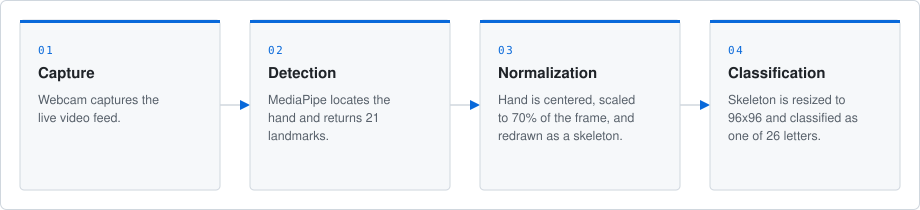
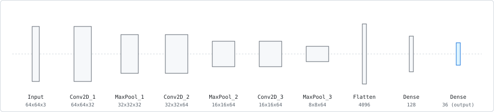
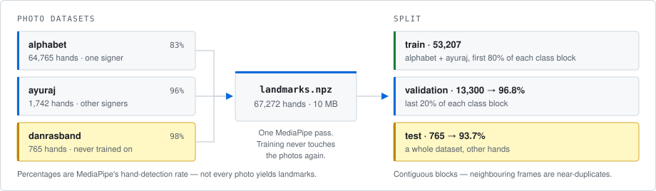
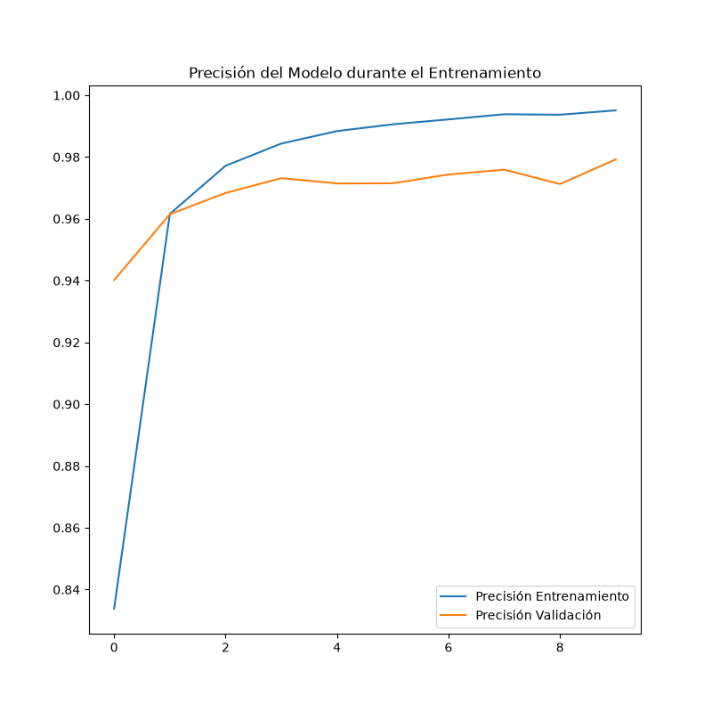

# ASL Real-Time Translator

A computer vision system that reads American Sign Language letters live from a webcam and spells them out on screen.

Instead of classifying raw camera frames, the pipeline first isolates the *structure* of the hand. MediaPipe extracts 21 hand landmarks per frame, which are normalized — centered and scaled to a fixed frame — and redrawn as a clean skeleton on a blank canvas. That skeleton, not the photograph, is what the model sees. This design choice removes lighting, background, clothing, and skin tone as variables entirely: by the time an image reaches the network, nothing is left but hand geometry.

<p align="center">
  
</p>

A convolutional neural network, trained from scratch in TensorFlow, classifies the skeleton into one of the 26 letters. For live inference the trained model is exported to ONNX and served with ONNX Runtime, so the translator starts instantly and runs in real time on CPU — no GPU or full TensorFlow runtime required at inference time.

<p align="center">
  
</p>

### One renderer, both sides

The single most important property of this pipeline is that **training and inference draw the skeleton with the same function**. `preprocessing.render_skeleton()` is called by the training data pipeline, by the evaluation script, and by the live translator.

That is not an aesthetic preference. An earlier version of this project trained on skeleton images rendered by someone else and drew its own at inference time, and the two disagreed in three ways at once: the live canvas was an OpenCV BGR buffer fed to a model trained on RGB, so every finger arrived with its red and blue channels swapped; the training hands sat anywhere between 29% and 76% of the canvas while the live hand was always centered at 70%; and the normalization mixed width-relative with height-relative units, squashing the live skeleton to about 75% of its true width on a 4:3 camera. Measured on the training data itself, those mismatches took the model from 98.6% down to 39.6% — which is why the on-screen prediction used to flicker wildly while the hand sat still.

Storing landmarks rather than images is what makes the shared renderer possible, and it has two side benefits: augmentation happens in landmark space (rotation, scale, translation, jitter, mirroring), which leaves stroke weight and palette untouched so every augmented sample still looks like something the renderer could produce from a real hand; and a whole dataset of landmarks is about 10 MB, small enough that training reads from RAM instead of walking through tens of thousands of files.

### Spelling

Letters accumulate into words. A letter is committed once it has been the top prediction for ten consecutive frames while the hand is still and above the confidence threshold. The same letter will not commit twice in a row — a hand held steady would otherwise spray repeats — so double letters need the `r` key or a brief move away and back.

Keys: `q` quit · `space` · `backspace` · `c` clear · `r` repeat last letter

### The interface

Everything is laid out in a **single window** by `ui.py`: the camera feed, the skeleton the model actually receives, the three classes it is weighing, and the word buffer. Earlier versions opened four separate OS windows that had to be dragged into position on every run, and which OpenCV's Qt backend decorates with a toolbar on Linux — `WINDOW_GUI_NORMAL` turns that off.

The styling stays deliberately plain — black background, OpenCV's default font, the same white/green/grey palette the separate windows used. This is a debugging surface for a model, and it should look like one.

`ui.py` holds no camera or model code, so the layout can be rendered from a synthetic state and checked as a PNG without a webcam.

Two buttons in the bottom-right open secondary windows, drawn regions clicked via `cv2.setMouseCallback` rather than a native toolkit's widgets: **Filters (zoom)** pops the convolutional filter mosaic full-size — useful because 32 tiles read poorly at the size the inline column has room for — and works whether or not `--activations` is on, since the model always computes those activations when it has them; only the inline column is gated by the flag. **Reference** opens `docs/asl-alphabet-reference.png` (see `build_reference.py`) to sign against. Both toggle closed on a second click, and both notice if you close the popup with its own window control instead — `cv2.imshow` would otherwise silently recreate a window the user just closed, which is why `realtime_translator.Popup` polls `WND_PROP_VISIBLE` rather than trusting its own `open` flag alone.

### J and Z

ASL's J and Z are movements, not poses. A frame-by-frame classifier can only ever see the handshape at the start or end of the gesture. `motion.py` watches the last 1.5 seconds of hand positions and checks whether the motion that should accompany a J-ish or Z-ish handshape is actually there — a descent and a hook for J, a zigzag with two corners for Z.

Two caveats worth stating plainly. It works on raw pixel landmarks divided by hand size, *not* the normalized ones, because re-centering the hand every frame is exactly what erases the movement. And it is a rule-based detector rather than a learned model: training a temporal model needs recorded sequences, and every ASL image dataset stores J and Z as single frames. Run with `--debug-motion` to see the measured values live and tune the thresholds at the top of `motion.py` to your camera and signing speed.

Sign these two deliberately rather than quickly. At 30 fps a fast gesture blurs the hand enough that MediaPipe drops it, and losing the hand clears the trajectory buffer, so a rushed J destroys its own evidence. The window is sized for unhurried signing for that reason.

### Digits

Earlier versions classified 36 signs, A–Z plus 0–9. The digits are gone, for two reasons that compound. The available data was drastically thin — 62 to 113 files per digit against 1,887 to 5,524 per letter, and the `0` class had only 34 unique images behind its 62 files — so digits made up under 1% of the dataset and a model could ignore them entirely at a cost of less than one point of accuracy. On top of that, several are genuinely indistinguishable as static handshapes: **0 and O, 2 and V, 6 and W, 9 and F** are the same pose. A flat 36-class model is asked to separate classes that cannot be separated from a still frame, and oscillating between them is the correct response to an ambiguous input rather than a bug.

### Stack
- **Detection:** MediaPipe Hands (21 landmarks, normalized in scale and position)
- **Model:** Custom CNN — 3 double-convolution blocks with batch norm and dropout, global average pooling, 2 dense layers
- **Inference:** ONNX Runtime (CPU)
- **Classes:** 26 (A–Z)

## Getting started

This repo ships the pretrained model — `asl_cnn_model.onnx` is ready to run.

```bash
pip install -r requirements.txt
python realtime_translator.py
```

Add `--activations` for the hidden-layer neuron grid, added under Top 3 in the same rail, and the convolutional filter mosaic, which gets a dedicated third column at full height. Both read named outputs off the ONNX graph, so they keep working across retrains. `--debug-motion` adds the live J/Z trajectory measurements, for tuning the thresholds in `motion.py`. Requires a webcam.

The repo ships `docs/asl-alphabet-reference.png` too, which the **Reference** button opens — one photo per letter to check your handshape against. The checked-in one is a real photo reference; `build_reference.py` can also generate a skeleton-based one (fresh through `preprocessing.render_skeleton()` if `landmarks.npz` is present, otherwise upscaled from `docs/render-check.png`) if you'd rather match exactly what the model sees instead of a photographed hand.

## Two environments

Training and inference need **separate virtual environments**. MediaPipe 0.10 pins `protobuf<5` while current TensorFlow requires `>=5.28`, so they cannot be installed together. `preprocessing.py` depends only on OpenCV and NumPy precisely so both sides can import it.

| | `requirements.txt` | `requirements-train.txt` |
|---|---|---|
| Used by | `realtime_translator.py`, `prepare_dataset.py` | `train_model.py`, `evaluate.py`, `export_onnx.py` |
| Key pins | `mediapipe>=0.10.21,<1.0`, `numpy<2` | `tensorflow[and-cuda]` on Linux |

MediaPipe 1.0 removed the `mediapipe.solutions` API that the Hands detector lives in, so that upper bound is load-bearing. Use Python 3.11 or 3.12 — neither TensorFlow nor MediaPipe ships wheels for 3.13+.

## Reproducing the model

```bash
# 1. Landmarks from the original photographs (one MediaPipe pass, ~10 MB out)
python prepare_dataset.py --source alphabet=~/datasets/asl_alphabet_train \
                          --source ayuraj=~/datasets/asl_dataset \
                          --source danrasband=~/datasets/danrasband

# 2. Train, holding out one entire dataset as an unseen test set
python train_model.py --landmarks landmarks.npz --epochs 40 --test-dataset danrasband

# 3. Confusion matrix and per-class metrics
python evaluate.py

# 4. Export for inference, with a Keras-vs-ONNX parity check
python export_onnx.py
```

Three sources rather than two, because the test set has to come out of training and the training set still needs more than one signer in it. `alphabet` is large but is a single subject; `ayuraj` adds different hands; `danrasband` is held out entirely so the reported test number describes the model actually shipped, rather than a weaker one trained without the second subject.

<p align="center">
  
</p>

Point `--source` at the **original photographs**, not at pre-rendered skeletons — the whole point of step 1 is to extract the landmarks ourselves. It reports the hand-detection rate per class; MediaPipe will not find a hand in every image, and a class that falls well below the others is worth knowing about before training rather than after.

### Reading the results

`evaluate.py` reports two numbers, and the gap between them is the interesting part.

**Validation** is a held-out contiguous block from the same recordings. It measures how well the model learned these particular hands. It is deliberately *not* a random split: these datasets are sequences of near-identical frames, so a random 80/20 puts a near-duplicate of almost every validation image into the training set. An earlier version of this project did exactly that and reported 97.9% while struggling on a live webcam.

**Test** is an entire dataset the model never saw, ideally recorded by different people. This is the number that predicts live behaviour, and it is normally much lower. Treat it as the honest one.

The current model, trained on 67,272 landmark sets across the three sources:

| | accuracy |
|---|---|
| Validation — held-out block, same recordings | 96.8% |
| **Test — `danrasband`, never seen** | **93.7%** |
| Gap | 3.0 points |

A three-point gap is small for this kind of data, and it is small because the training set contains more than one signer. Read the test number as the one that matters.

Accuracy alone describes a bare `argmax`, which is not what the translator does — it only commits a letter above `COMMIT_CONFIDENCE`. `evaluate.py` therefore also reports what happens at that gate, and how stable predictions are when the same hand is re-rendered under small perturbations, which is the measurement that corresponds to the original flickering symptom:

| | |
|---|---|
| Coverage at the commit threshold | 94.6% of hands |
| Precision once committed | 96.7% |
| Prediction unchanged under jitter, when correct | 99.0% |
| …when the prediction was already wrong | 85.7% |

That last split is the reassuring one: predictions that are right hold still, and the flicker is concentrated on the genuinely ambiguous handshapes rather than scattered at random.

Expect leftover confusions between letters that genuinely share a handshape — M, N, S and T are all a fist with the thumb in a different place. Those are the signal that the model is behaving sensibly; anything else in the confusion matrix is worth investigating. **N is the weakest class by a clear margin** (54% recall on the test set, usually mistaken for M), and it compounds: N was also the only class where MediaPipe's hand-detection rate fell below 60%, so it reached training with the fewest examples of any letter.

<p align="center">
  
</p>

Training regenerates that plot on every run. Watch for training and validation staying close: a widening gap means the model is memorizing examples instead of learning the shape of the signs.

### On GPUs

TensorFlow dropped native GPU support on Windows after 2.10, so training there is CPU-only. On Linux, `tensorflow[and-cuda]` bundles the CUDA and cuDNN wheels and an NVIDIA driver is the only system dependency. Keep the dataset off any synced folder — reading tens of thousands of files out of a cloud-synced directory was the original reason this project needed an on-disk cache, and storing landmarks instead removes the problem entirely.

Those bundled wheels install their shared libraries under `site-packages/nvidia/*/lib`, which TensorFlow does not add to the loader path itself. If `tf.config.list_physical_devices('GPU')` returns an empty list on a machine whose driver is fine and `nvidia-smi` works, that is usually why; putting those directories on `LD_LIBRARY_PATH` before the interpreter starts is enough to fix it.

`export_onnx.py` pins its own verification to the CPU for a related reason. The exported graph runs on ONNX Runtime's CPU kernels in production, so the Keras reference it is checked against has to run there too — comparing a cuDNN forward pass against an ONNX Runtime one measures the difference between two kernel implementations rather than the fidelity of the conversion, and at this model's logit scale that difference alone is large enough to fail the check.

## License

The **code** in this repository is licensed under the [MIT License](LICENSE) — see `LICENSE` for the full text.

That does **not** cover the training data or the trained model weights (`asl_cnn_model.onnx`), which are derived from third-party datasets with their own terms. The skeleton palette in `preprocessing.py` is transcribed from MediaPipe's `drawing_styles`, which is Apache-2.0.

The model is trained on three Kaggle datasets:

| Dataset | Role | License |
|---|---|---|
| [ASL Alphabet](https://www.kaggle.com/datasets/grassknoted/asl-alphabet) by Akash Nagaraj | main training set (~78k images, one subject) | GPL-2.0 |
| [ASL Dataset](https://www.kaggle.com/datasets/ayuraj/asl-dataset) by Ayush Thakur | additional signers in training | CC0-1.0 |
| [ASL Alphabet Test](https://www.kaggle.com/datasets/danrasband/asl-alphabet-test) by Dan Rasband | held-out test set | CC0-1.0 |

In practice: reuse and modify the code freely under MIT. The weights are a different matter — the largest share of the training data is GPL-2.0, so if you redistribute `asl_cnn_model.onnx` rather than retraining it yourself, credit the datasets above and check those terms against your intended use. Whether trained weights constitute a derivative work of their training data is unsettled, and this note is a pointer to the licenses, not legal advice.
